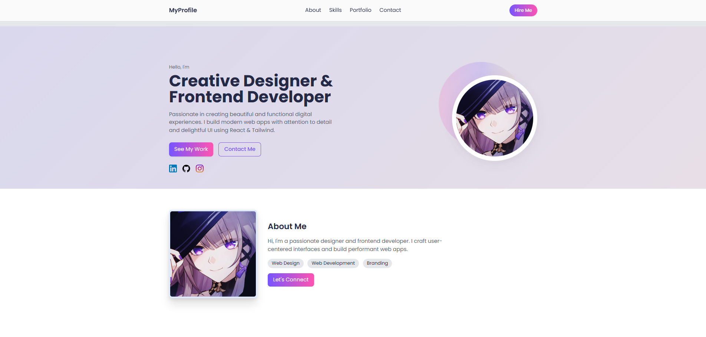
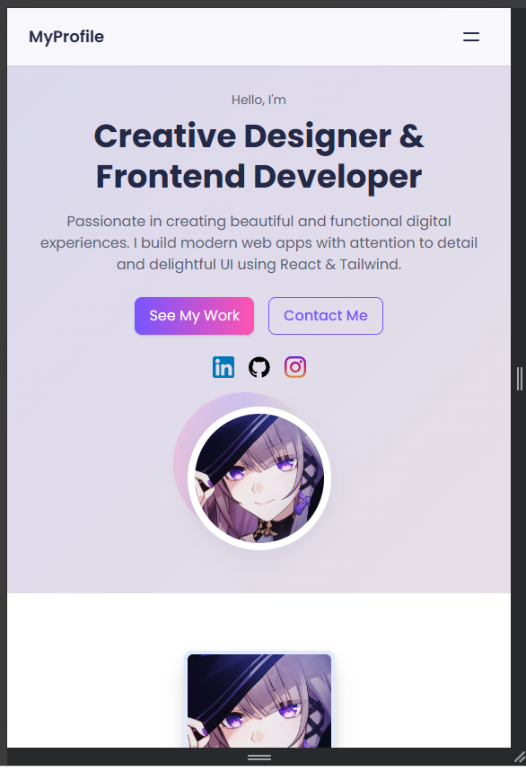

# Personal Profile Website

A modern and responsive personal portfolio website built with React and Tailwind CSS. This project showcases a clean and professional design perfect for creative designers and frontend developers.
 


## Screenshots

### Desktop Preview


### Mobile Preview


## Features

- 🎨 Modern and clean UI design
- 📱 Fully responsive layout
- ⚡ Fast and optimized performance
- 🎯 Clear call-to-action buttons
- 🔍 SEO friendly
- 💅 Styled with Tailwind CSS

## Tech Stack

- React.js
- Tailwind CSS
- PostCSS
- Modern JavaScript (ES6+)

## Project Structure

```
src/
├── assets/
│   ├── fonts/
│   └── images/      # Images and SVG icons
├── components/
│   ├── AboutSection.js
│   ├── Footer.js
│   ├── navbar.js
│   └── ProfileCard.js
└── pages/
    └── Home.js
```

## Components

### ProfileCard
- Main hero section with profile information
- Social media links
- Call-to-action buttons
- Responsive profile image with gradient decoration

### AboutSection
- Personal introduction and skills
- Professional background information

### Navbar
- Responsive navigation
- Smooth scroll to sections

### Footer
- Contact information
- Additional links

## Getting Started

This project was bootstrapped with [Create React App](https://github.com/facebook/create-react-app).

### Prerequisites

- Node.js (v14 or higher)
- npm or yarn

## Available Scripts

In the project directory, you can run:

### `npm start`

Runs the app in the development mode.\
Open [http://localhost:3000](http://localhost:3000) to view it in your browser.

The page will reload when you make changes.\
You may also see any lint errors in the console.

### `npm test`

Launches the test runner in the interactive watch mode.\
See the section about [running tests](https://facebook.github.io/create-react-app/docs/running-tests) for more information.

### `npm run build`

Builds the app for production to the `build` folder.\
It correctly bundles React in production mode and optimizes the build for the best performance.

The build is minified and the filenames include the hashes.\
Your app is ready to be deployed!

See the section about [deployment](https://facebook.github.io/create-react-app/docs/deployment) for more information.

### `npm run eject`

**Note: this is a one-way operation. Once you `eject`, you can't go back!**

If you aren't satisfied with the build tool and configuration choices, you can `eject` at any time. This command will remove the single build dependency from your project.

Instead, it will copy all the configuration files and the transitive dependencies (webpack, Babel, ESLint, etc) right into your project so you have full control over them. All of the commands except `eject` will still work, but they will point to the copied scripts so you can tweak them. At this point you're on your own.

You don't have to ever use `eject`. The curated feature set is suitable for small and middle deployments, and you shouldn't feel obligated to use this feature. However we understand that this tool wouldn't be useful if you couldn't customize it when you are ready for it.

## Learn More

You can learn more in the [Create React App documentation](https://facebook.github.io/create-react-app/docs/getting-started).

To learn React, check out the [React documentation](https://reactjs.org/).

### Code Splitting

This section has moved here: [https://facebook.github.io/create-react-app/docs/code-splitting](https://facebook.github.io/create-react-app/docs/code-splitting)

### Analyzing the Bundle Size

This section has moved here: [https://facebook.github.io/create-react-app/docs/analyzing-the-bundle-size](https://facebook.github.io/create-react-app/docs/analyzing-the-bundle-size)

### Making a Progressive Web App

This section has moved here: [https://facebook.github.io/create-react-app/docs/making-a-progressive-web-app](https://facebook.github.io/create-react-app/docs/making-a-progressive-web-app)

### Advanced Configuration

This section has moved here: [https://facebook.github.io/create-react-app/docs/advanced-configuration](https://facebook.github.io/create-react-app/docs/advanced-configuration)

### Deployment

This section has moved here: [https://facebook.github.io/create-react-app/docs/deployment](https://facebook.github.io/create-react-app/docs/deployment)

### `npm run build` fails to minify

This section has moved here: [https://facebook.github.io/create-react-app/docs/troubleshooting#npm-run-build-fails-to-minify](https://facebook.github.io/create-react-app/docs/troubleshooting#npm-run-build-fails-to-minify)

## Customization

### Tailwind Configuration
The project uses Tailwind CSS for styling. You can customize the theme in `tailwind.config.js`:

- Colors
- Typography
- Spacing
- Breakpoints
- And more

### Content
Update the content by modifying the components in the `src/components` directory.

## Contributing

1. Fork the repository
2. Create your feature branch (`git checkout -b feature/AmazingFeature`)
3. Commit your changes (`git commit -m 'Add some AmazingFeature'`)
4. Push to the branch (`git push origin feature/AmazingFeature`)
5. Open a Pull Request

## License

This project is open source and available under the MIT License.

## Contact

Project Link: [https://github.com/n3k0gama/front-end](https://github.com/n3k0gama/front-end)
